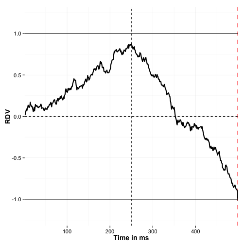
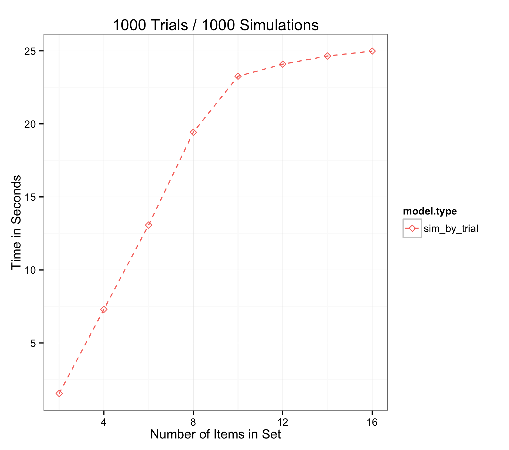
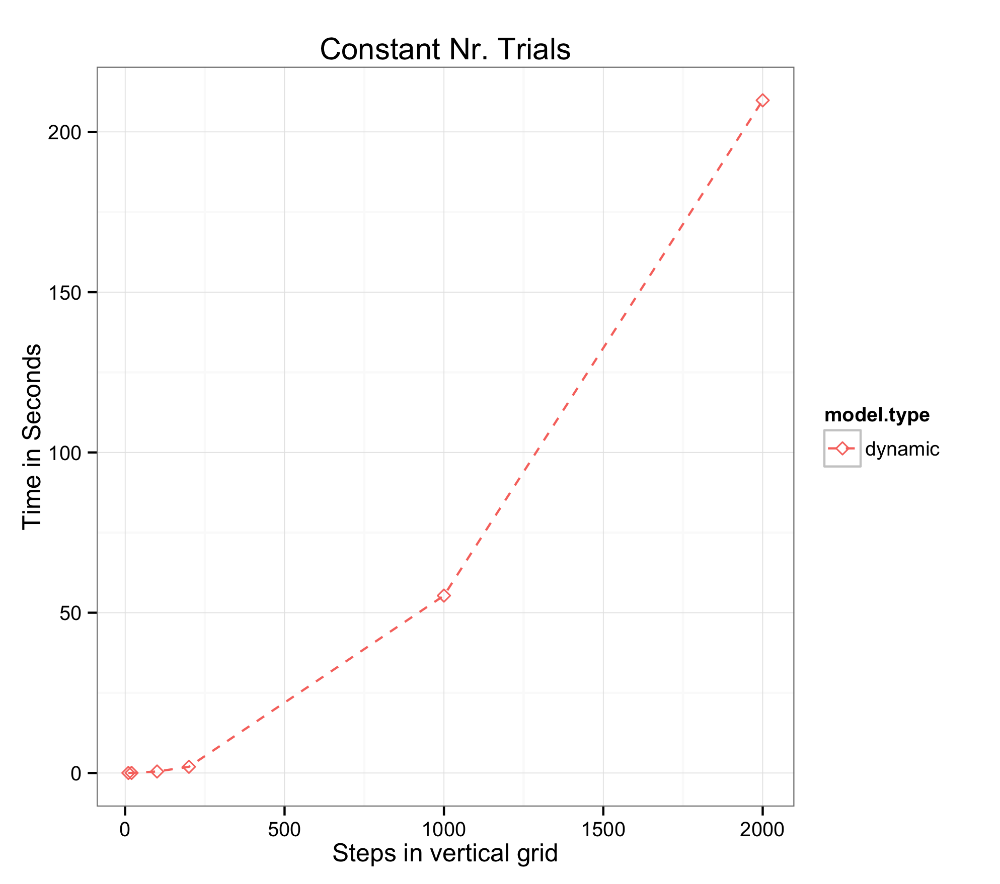
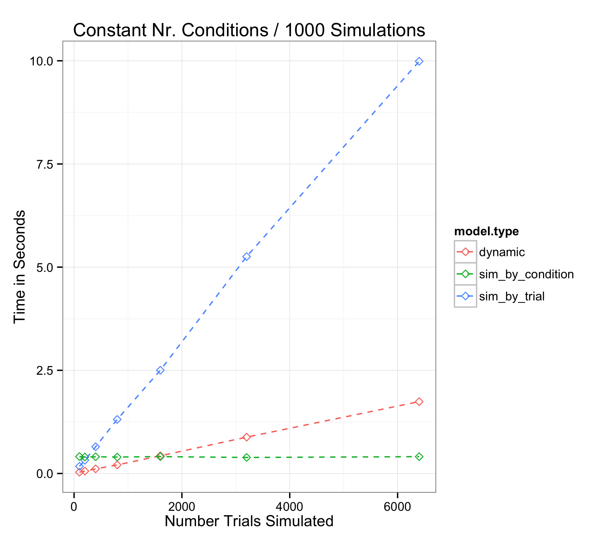
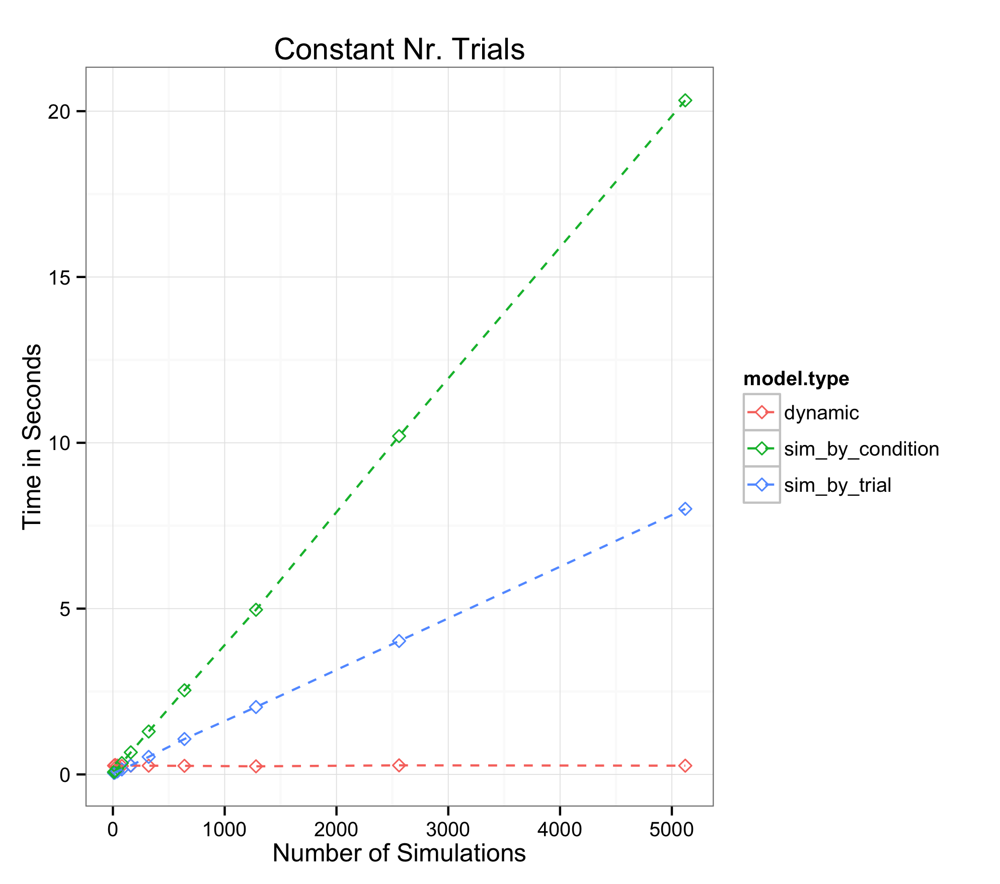
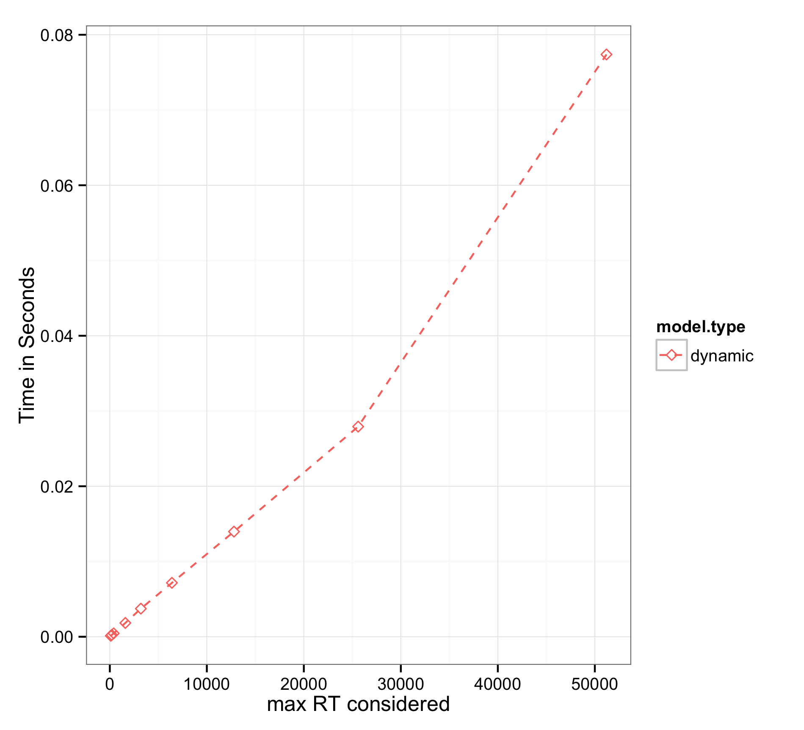

addmtoolbox: tutorial
========================================================
author: Alexander Fengler
date: 03.03.2015
font-family: 'Helvetica';


aDDM: quick intro // equations 2 items
========================================================

<p class="test"> <strong>Equations: 2 Items</strong></p>
 <br>
<span><strong>Fixation left:</strong></span>
<br> <br>
$$
\begin{aligned}
  RDV_t = RDV_{t-1} + d*(r_{left} - \theta*r_{right}) + \epsilon_t
\end{aligned}
$$

<span><strong>Fixation right:</strong></span>
<br> <br>
$$
\begin{aligned}
  RDV_t = RDV_{t-1} + d*(\theta*r_{left} - r_{right}) + \epsilon_t
\end{aligned}
$$

<br>
Decision taken if $RDV_t > 1$ | $RDV_t < -1$ ....

aDDM: quick intro // n > 2 items
==========================================================

<span><strong>Acummulate Evidence (Item 1 Fixated): </strong></span>
<br>

$$
\begin{align*}
  E^{1}_t &= E^{1}_{t-1} + d*V^{1} + \epsilon_{t} \\
  E^{2}_t &= E^{2}_{t-1} + \theta*d*V^{2} + \epsilon_{t} \\
  E^{3}_t &= E^{3}_{t-1} + \theta*d*V^{3} + \epsilon_{t} \\
\end{align*}
$$

<span><strong>Compute Global RDV:</strong></span>

$$
\begin{align*}
  RDV^{1}_t &= E^{1}_t - max(E^{2}_t,E^{3}_t) \\
  RDV^{2}_t &= E^{2}_t - max(E^{1}_t,E^{3}_t) \\
  RDV^{3}_t &= E^{3}_t - max(E^{1}_t,E^{2}_t) \\
\end{align*}
$$

$$
\begin{align*}
  RDVG_t &= max(RDV^{1}_t, RDV^{2}_t, RDV^{3}_t) \\
\end{align*}
$$

aDDM: quick intro // multiattribute (2)
==========================================================

<br> <br>

<span><strong>Fixation left (Attribute 1):</strong></span>

$$
\begin{align*}

RDV_t = RDV_{t-1} +  d*(V^{1}_1 - \theta*V^{2}_1 + \gamma*(V^{1}_2 - theta*V^{2}_2)) + \epsilon_t

\end{align*}
$$

<br>

Decision taken if $RDV_t > 1$ | $RDV_t < -1$ ....

<br>
New parameter $\gamma$ that discounts unfixated attributes separately.


aDDM: quick intro // code
========================================================
left: 30%

Variables:
<small style="font-size:.6em">

```r
# Item Valuations
v1 = 2
v2 = 4

# Model
rdv = 0
theta = 0.1
d = 0.002
sd = 0.02
```
</small>

***
Model:
<small style="font-size:.6em">

```r
fixpos.vector = rep(c(1, 2, 1, 2), each = 250)
time = 1

while (rdv < 1 & rdv > -1) {
    
    if (fixpos.vector[time] == 1) {
        rdv = rdv + d * (v1 - theta * v2) + rnorm(1, 0, sd)
    }
    
    if (fixpos.vector[time] == 2) {
        rdv = rdv + d * (theta * v1 - v2) + rnorm(1, 0, sd)
    }
    
    time = time + 1
}
```
</small>


aDDM: quick intro // visualization
========================================================



aDDM quick intro // likelihood
========================================================

We simulate the model (many times) with a given set of parameters...

Then produce table like this,

| Trial id | Choice   |  RT Bin  |   Likelihood of event (given our model / parameters)|
| ---------|------ |------|----------|
|1|     1  |   1800   |     0.03     |
|2|    1  |  2200   |   0.05      |
|3|      2  |  2000     |     0.04      |
|.| . | . | . |
|.| . | . | . |
|n| 1 | 3000 | 0.02 |

Then we take the sum of the log of the likelihood values.

aDDM quick intro // fit by condition
========================================================
<br>
*Standard way of fitting the addm,*


 - define unique trial conditions

 - build fixation model

 - simulate model by unique trial condition with own fixation model


**Implemented** in addmtoolbox. You can supply your own arbitrary fixation model
and the package will use it in the simulations.

*Example fixation models* included. Fixed and random fixation pathways with fixed duration length.


aDDM quick intro // fit by trial
========================================================
<br>
*Alternative way of fitting the addm,*

<br>

  - simulate model by unique trial

  - use empirical fixations and rt to inform simulations

  - no need for separate fixation model for model fits


**Implemented** in addmtoolbox. *Note*, that you will still need a fixation model when simulating a fake data set, once you have the optimal parameters!

addmtoolbox: functions
========================================================
<br>
*What does it do for you?*

<br>

Data Preprocessing

Generate Fake Data

Model Simulation

Model Fitting

Plotting Results


***
<br>
*Functions*

<br>

**addm_preprocess()**

**addm_generate...()**

**addm_run...()**

**addm_fit...()**

**addm_plot...()**

addmtoolbox: internal functions
========================================================
<br>
*What does it do for you?*

<br>

Internal computations

Evidence Accumulation

***

<br>
*Functions*

<br>

**addm_support...( )**

**aevacc_...( )** *(c++)*

addmtoolbox: internal functions
========================================================

<br>

All functions are documented and available to you!

<br>

Every function that has a "2" in it's name (**addm2_**, **aevacc2_**) is preferred when working with two items.
Other functions with the same name are item general.


addmtoolbox: documentation
========================================================
General Package info:

```r
?addmtoolbox
```

Detailed function documentation:


```r
?addm_preprocess
```

Tutorials:


```r
# List Vignettes
vignette(package = 'addmtoolbox')
# Access Vignette
vignette('addmtoolbox_modelfit_walkthrough')
```

addmtoolbox: data
========================================================
<br>
The addmtoolbox comes with a full **set of example data**.
to make it easier to,

- Understand the **data format expected** by addmtoolbox
<br> <br>
- Understand the **data formats returned** by addmtoolbox


The corresponding data frames are **automatically loaded** with the package.


```r
View(addm_data_choice)
View(addm_data_eye)
```


addmtoolbox: data
========================================================

*Data Type*

<br>

Choice/RT Data

Eyetracking Data

Example Loglikelihood output

Detailed aDDM Output

***

*Data Frame*

<br>

**addm_data_choice**

**addm_data_eye**

**addm_data_loglik_trial/condition**

**addm_data_full_output**


addmtoolbox: benchmarks //  1-6
========================================================

</img>


addmtoolbox: benchmarks //  2-6
========================================================
</img>

addmtoolbox: benchmarks //  3-6
========================================================

</img>

addmtoolbox: benchmarks //  4-6
========================================================

</img>

addmtoolbox: benchmarks //  5-6
========================================================

</img>

addmtoolbox: benchmark // 6-6
========================================================
</img>

wd
========================================================
<small style="font-size:.6em">

```r
getwd()
```

```
[1] "/Users/admin/OneDrive/git_repos/addmtoolbox/temp/tutorial_intro"
```
</small>

addmtoolbox
========================================================
<br> <br> <br> <br>

Questions?
