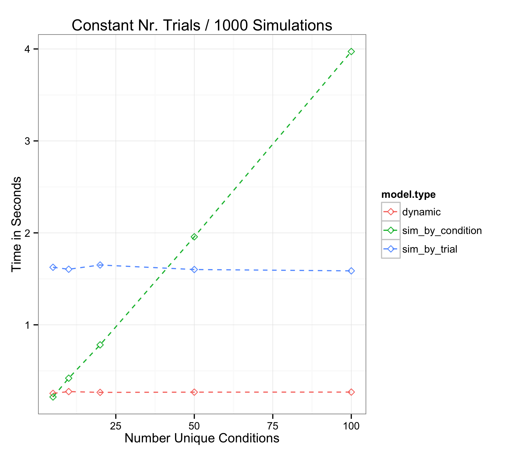
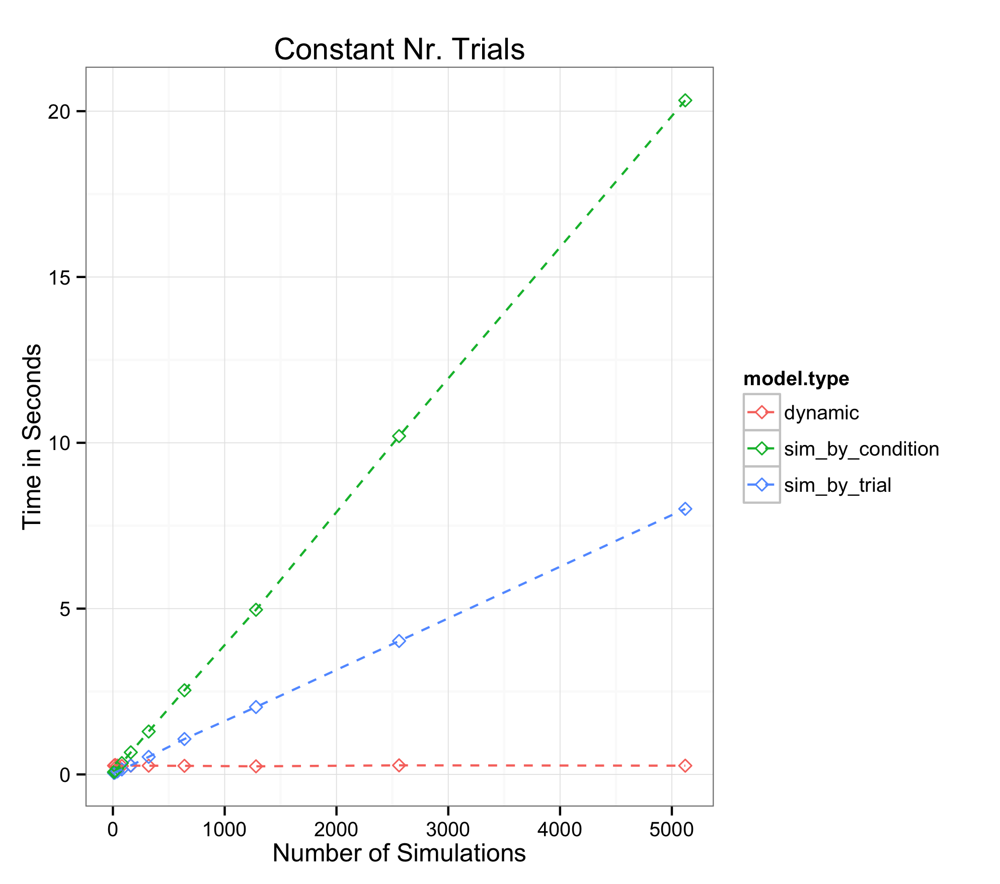
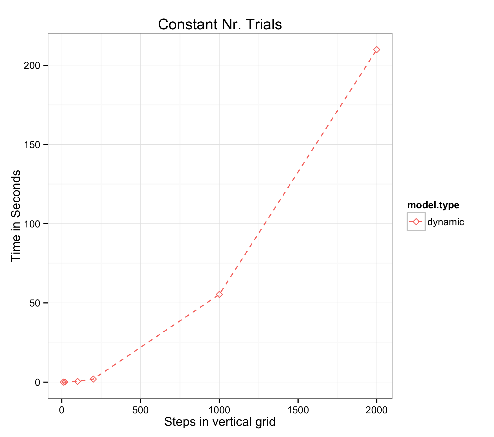

This vignette provides a collection of plots that illustrate important performance aspects of the various algorithms that are employed by the addmtoolbox package.
The plots compare the speed aspects across and within algorithms, when changing relevant parameters. 

 

There are two in which (a)ddm-fits are accomplished in the addmtoolbox. By **simulations**, or via a **dynamic-programming algorithm** (which currently only works for the two item case). We can calculate likelihood-estimates **by condition** (`fit.type = 'condition`), or **by_trial** (`fit.type = 'trial`) with simulations, however currently only **by_trial** (`fit.type = dyn`), when utilizing the **dynamic programming algorithm**. In the plots the three named algorithms are identified as *sim_by_condition*, *sim_by_trial* and *dynamic*.

 

# 1-6 Vary Nr. Conditions

 

 </img>

 

This plot illustrates how an increae in the number of unique trial conditions, while holding the number of unique trials constant, quickly diminishes the advantage that **by condition** fitting affords when dealing with sever condition to trial imbalances. The **by condition** simulations, are mostly slowed down from a by-run computation of fixation pathways, a pehnomenon that does not occur for by trial fits, given strict usage of empirical fixation data. 

 

# 2-6 Vary Nr. Trials

 

 </img>

 

As an analogue to the variation in number of conditions, when holding absolute amount of trial constant, we can look at a variation in trial numbers, when holding the number of conditions constant. We see the opossite scenario of an impact on the dynamic as well as the simulation based by trial algorithms, whereas the speed of the by condition runs is not affected.

 

# 3-6 Vary Nr. Simulations

 

 </img>

 

This plot illustrates, what is trivially to be expected, that the speed of simulation algorithms is linearly dependent on the number of simulation runs. While simulations, can be faster even than the dynamic-programming algorithm, the amount of simulations that guarantee speed-parity when comparing to the standard version of the dynamic programming algorithm (utilizing a vertical grid with 21 steps), is much to low for stable likelihood estimates. As will be seen in the next plot, the vertical-grid size matters quite a lot though for speed of the dynammic programming algorithm. It is important to note, that the precision of the vertical grid has indeed an effect on likelihood computations. The speed ranking is therefore not as easily established between simulation-based and dynamic programming based approaches to modeling a drift diffusion process.

 

# 4-6 Vary Nr. States in Vertical Grid

 

 </img>

 

We can observe that the relationship between the amout of steps in the vertical grid, has an exponential relationship with execution time. An important phenomenon.

 

# 5-6 Vary RT 

 

 </img>

 

In contrast to the vertical grid size, increasing the horizontal grid (effectively by allowing longer reaction times to be permitted), has an approximately linear relationship with execution time. This is trivially to be expected.

 

# 6-6 Vary Set Size

 

 </img>

 

Another important aspect of the algorithms, especially when dealing with data sets of more than two items, and possibly mutliple differing set-sizes at once, is the cost in execution time that is paid when adding more items to choice sets. It seems that this relationship follows a root function, which is very encouraging, however more detailed testing is need to confirm this. It may be that interactions between chioce set size and reaction times (when holding all relevant parameters constant across choice set sizes) are responsible for this behavior.
 
 

